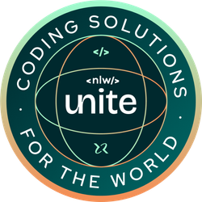
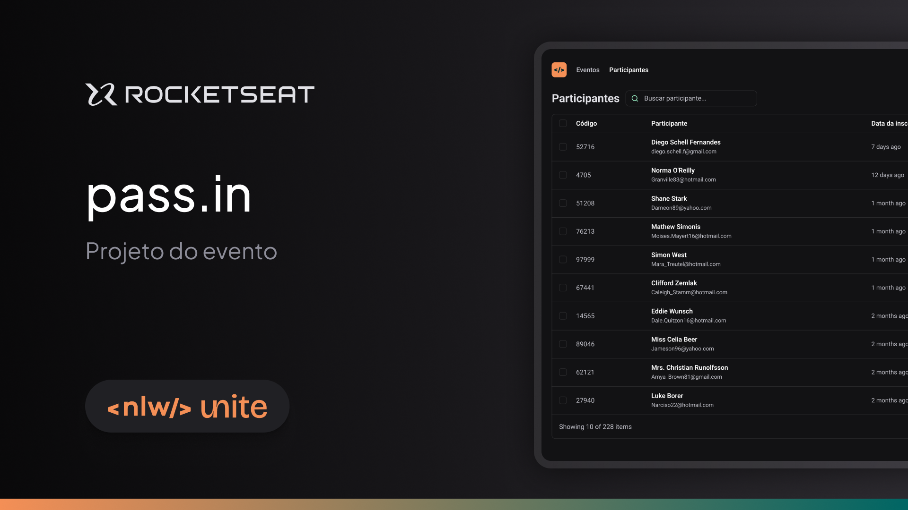
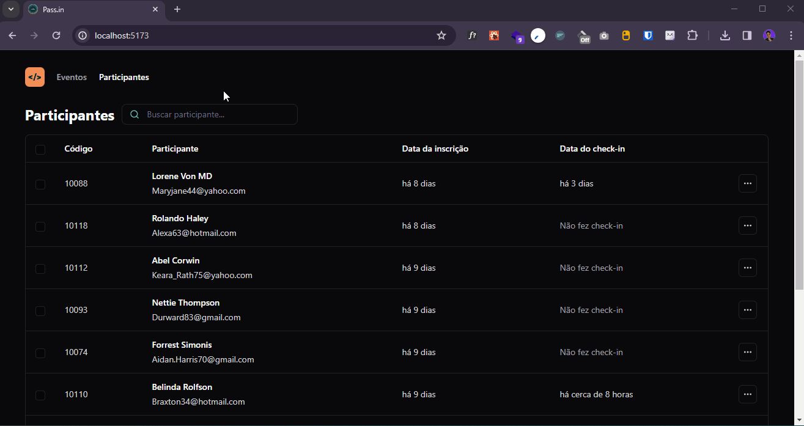

<h1 align="center">
  
  NLW Unite (React)
</h1>

<p align="center">
  

  

  
  
  <a href="https://github.com/pabloxt14/nlw-unite-react/commits/master">
    
  </a>
    
   

   <a href="https://github.com/pabloxt14/nlw-unite-react/stargazers">
    
  </a>
</p>

<p>
  
</p>

<h4 align="center"> 
	🚀 Aplicação finalizada 🚀
</h4>

<p align="center">
 <a href="#-about">About</a> | 
 <a href="#-layout">Layout</a> | 
 <a href="#-setup">Setup</a> | 
 <a href="#-technologies">Technologies</a> | 
 <a href="#-license">License</a>
</p>


## 💻 About

Esta aplicação de nome **Pass.in** consiste em um sistema de gestão de participantes de eventos, com um dashboard para organizadores.

O principal aprendizado neste projeto é a persistência de estados de URL para manter as interações dos usuários, mesmo após recarregar a página. Além da implementação de uma interface totalmente padronizada com princípios de um design usando o Tailwind.

Essa aplicação foi desenvolvida durante o NLW Unite da [Rocketseat](https://www.rocketseat.com.br/) utilizando principalmente tecnologias como React, TypeScript e Tailwind.


<!-- ## 🔗 Deploy

O deploy da aplicação pode ser acessada através da seguinte URL base: https://pabloxt14-nlw-expert-notes.vercel.app/ -->


## 🎨 Layout

Você pode visualizar o layout do projeto através [desse link](https://www.figma.com/community/file/1356738933008624188/unite-summit). É necessário ter conta no [Figma](https://www.figma.com/) para acessá-lo.

Veja uma demonstração visual da aplicação:

<p align="center">
  
</p>


## ⚙ Setup

### 📝 Requisites

Antes de baixar o projeto você vai precisar ter instalado na sua máquina as seguintes ferramentas:

* [Git](https://git-scm.com)
* [NodeJS](https://nodejs.org/en/)
* [NPM](https://www.npmjs.com/) ou [Yarn](https://yarnpkg.com/) 
* Para reproduzir o acesso a API back-end com os dados necessários para o front-end, clone o seguinte [repositório](https://github.com/rocketseat-education/nlw-unite-nodejs) que contem a API do nosso back-end feita em Node.js e execute na sua máquina.

Além disto é bom ter um editor para trabalhar com o código como [VSCode](https://code.visualstudio.com/)

### Cloning and Running

Passo a passo para clonar e executar a aplicação na sua máquina:

```bash
# Clone este repositório
$ git clone git@github.com:pabloxt14/nlw-unite-react.git

# Acesse a pasta do projeto no terminal
$ cd nlw-unite-react

# Instale as dependências
$ npm install

# Execute a API back-end

# Execute a aplicação em modo de desenvolvimento
$ npm run dev

# A aplicação inciará em alguma porta disponível que poderá ser acessada pelo navegador
```


## 🛠 Technologies

As seguintes principais ferramentas foram usadas na construção do projeto:

- **[Vite](https://vitejs.dev/)**
- **[TypeScript](https://www.typescriptlang.org/)**
- **[TailwindCSS](https://tailwindcss.com/)**
- **[Tailwind Merge](https://www.npmjs.com/package/tailwind-merge)**
- **[Lucide React](https://lucide.dev/guide/packages/lucide-react)**
- **[date-fns](https://date-fns.org/)**

> Para mais detalhes das dependências gerais da aplicação veja o arquivo [package.json](./package.json)


## 📝 License

Este projeto está sob a licença MIT. Consulte o arquivo [LICENSE](./LICENSE) para mais informações

<p align="center">
  Feito com 💜 por Pablo Alan 👋🏽 <a href="https://www.linkedin.com/in/pabloalan/" target="_blank">Entre em contato!</a>  
</p>